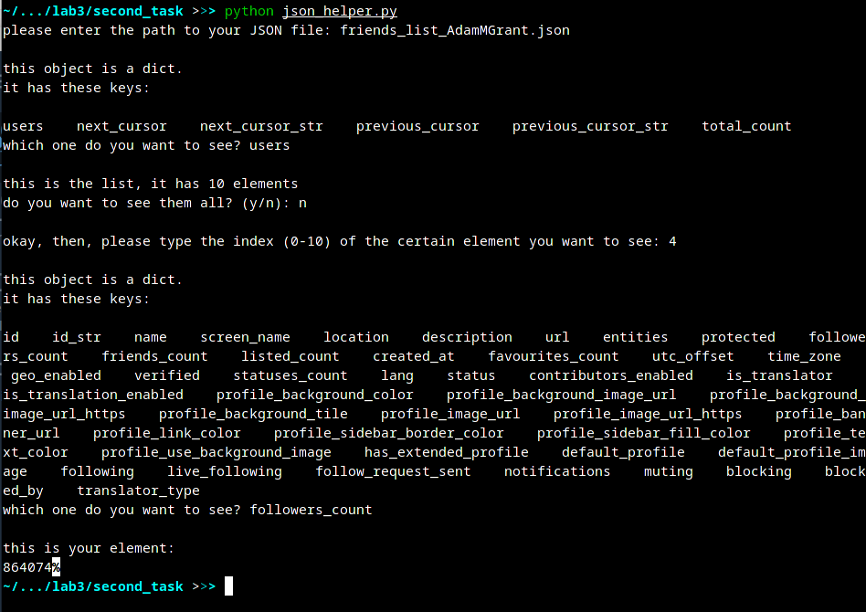

# navigation_json

JSON helper is a module for parsing a json object (file) obtained using the Twitter API (or any other JSON file). The module contains functions to provide easy access to various parts of the json object.

The main goal - navigation through the json-object.

After the API returns a specific object, the user will be prompted with a set of fields from which he can select the desired one. In response to the user-entered key, you must show the corresponding value. Then:
1. if the value corresponding to the key is also an object - in this case, the user is notified that it is also an object, and the available keys are displayed;
2. if the value is a list - it is suggested to either just show the whole list, or report that it is a list, and ask which number of the list item to display.

Also, it is provided that if the user enters incorrect data, then the program will ask him/her to check his/her input and enter it again.

When you start the program, the main function called 'show_info_user' runs, which communicates with the user to determine what exactly needs to be displayed.

Example of program operation:

## License
[MIT](https://github.com/alinamuliak/twitter_project/blob/main/LICENSE)